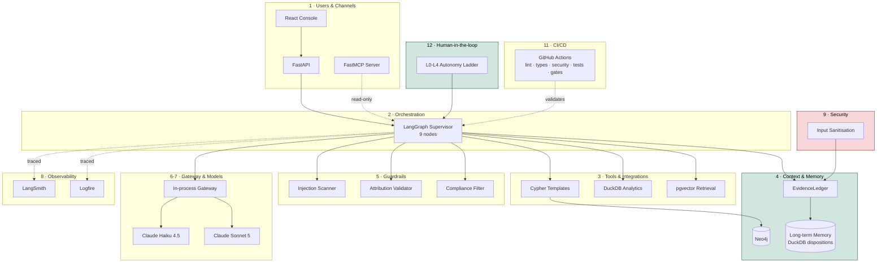
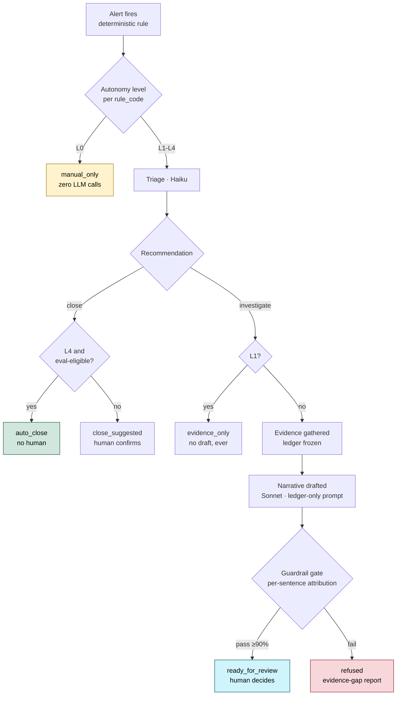

<div align="center">

# CaseWeave

**An agentic AML investigation copilot that refuses to guess.**

[](https://github.com/AaronFChristian/caseweave/actions/workflows/ci.yml)
[](https://www.python.org/)
[](#testing--evaluation)
[](#license)

Triages AML alerts, assembles evidence from a transaction knowledge graph, and drafts a
regulatory filing narrative where **every sentence is either provably grounded in
evidence or refused outright.**

[Architecture](#architecture) · [Key Features](#key-features) · [Quickstart](#quickstart) · [Known Limitations](#known-limitations)

</div>

> **All data in this repository is synthetic.** No real customer transactions, no real
> borrower financials, no real filings. The entire dataset is generated from a fixed
> seed. This is a portfolio system demonstrating architecture, evaluation design, and
> observability practice — it is **not** validated compliance software.

---

## Table of contents

- [The problem](#the-problem)
- [Design thesis](#design-thesis)
- [Architecture](#architecture)
- [Runtime flow](#runtime-flow)
- [Key features](#key-features)
- [Tech stack](#tech-stack)
- [Quickstart](#quickstart)
- [Repository layout](#repository-layout)
- [Testing & evaluation](#testing--evaluation)
- [Known limitations](#known-limitations)
- [Engineering notes](#engineering-notes)
- [License](#license)

---

## The problem

Transaction-monitoring systems generate alerts faster than anyone can investigate them.
Published industry analysis puts the false-positive rate at **90–95%**. When something
does look real, an investigator manually assembles a timeline and writes a
**Suspicious Activity Report (SAR)** narrative — a document filed with FinCEN, a federal
regulator.

That narrative is a legal filing. A hallucinated sentence in it isn't a UX problem — it's
a false statement to the government. That single constraint shapes this entire
architecture.

## Design thesis

> **Evidence is deterministic. Prose is probabilistic. Nothing crosses that line without
> a citation.**

Every fact that could end up in a narrative — a transaction, a KYC record, a graph
pattern, a regulatory citation, a prior disposition on the same subject — gets a unique
ID and lands in a frozen `EvidenceLedger` *before* any model writes a word. The narrative
model is shown only that ledger, never a raw database row. After drafting, a guardrail
checks every sentence individually: does it cite a real fact, and does that fact actually
entail the claim? Below a 90% coverage threshold, the system refuses to produce a
narrative and returns an evidence-gap report instead.

This isn't a policy statement — it's been verified live, catching a real hallucination in
production testing (Sonnet quietly extended a regulatory citation to cover a business
type the source material never named; the guardrail caught it and refused).

---

## Architecture

Twelve layers, each mapped to a concrete implementation and an honest status.



| # | Layer | Implementation | Status |
|---|---|---|---|
| 1 | **Users & channels** | React review console, FastAPI, FastMCP server | Console browser-verified; MCP server unit-tested |
| 2 | **Orchestration** | LangGraph — 9 nodes, deterministic edges + one LLM-routed branch + one config-governed branch | Live-traced via LangSmith |
| 3 | **Tools & integrations** | Parameterised Cypher templates, DuckDB analytics, hybrid pgvector retrieval | Live-traced via Logfire |
| 4 | **Context & memory** | Short-term (EvidenceLedger + checkpointer), vector store, knowledge graph, **durable long-term memory** | All real, proven live |
| 5 | **Guardrails** | Injection scanner, attribution validator (sentence-level), compliance filter | Sentence-level visibility in Logfire, zero chat UI needed |
| 6 | **LLM gateway** | In-process router — single chokepoint, task-based routing, caching, cost ledger | Real; Portkey evaluated, not adopted (see [Limitations](#known-limitations)) |
| 7 | **Model layer** | Claude Haiku 4.5 (triage, judge), Claude Sonnet 5 (narrative, typology) | Live-confirmed, real token accounting |
| 8 | **Observability** | LangSmith (graph + LLM calls), Logfire (tools, guardrails, API) | Both confirmed live, end-to-end |
| 9 | **Security & governance** | Injection defense, input sanitisation, reason-coded human decisions | **Weakest layer** — see [Limitations](#known-limitations) |
| 10 | **Infrastructure** | Dockerfile (multi-stage, non-root), docker-compose, fly.toml | Documented, not deployed |
| 11 | **DevOps / CI-CD** | GitHub Actions — lint, types, security scan, full test suite, Day 1/2/3 gates | **Green**, running on every push |
| 12 | **Human-in-the-loop** | L0–L4 autonomy ladder, eval-gated auto-close, reason-coded disposition | Real, tested, exercised live |

---

## Runtime flow



A real, pre-existing bug was caught building this: the graph used to auto-close every
"close" recommendation with zero human involvement, for every rule, regardless of level —
L4 behavior firing silently at L2. The `E` decision node above is the fix — nothing skips
the human unless the specific rule has **real golden-set evidence** backing it, re-checked
at execution time.

---

## Key features

<table>
<tr><td width="50%" valign="top">

### Attribution-conditioned generation
Sentence-level fact grounding with automated entailment verification via an independent
judge model — not a citation footer bolted on after the fact.

### Frozen EvidenceLedger
A hard, enforced separation between deterministic retrieval and probabilistic prose. The
ledger freezes before drafting; nothing can be added mid-generation.

### Graph-only detection
Six rules, five in SQL, one — circular fund flows — *provably invisible* to SQL. A
laundering ring's originator sends on the first hop and receives on the last, so it never
presents the inbound-then-outbound signature a flat table can see.
**Planted-subject recall: 91% → 100%** with the graph layer online.

</td><td width="50%" valign="top">

### Durable long-term memory
A repeat alert on the same subject surfaces prior disposition history as evidence,
backed by a real DuckDB table. Proven live: wrote a disposition through the real API,
confirmed it was queryable by subject on a subsequent case.

### Dual-backend observability
LangSmith traces orchestration + LLM calls; Logfire traces every tool call and every
guardrail decision at the **individual-sentence level**. No chat UI needed to see exactly
which sentence a guardrail rejected and why.

### Golden-set eval harness
Cases sampled from real ground-truth labels, five metrics per case, one zero-tolerance
check. CI runs this in mock mode on every push — a PR that breaks guardrail wiring cannot
merge.

</td></tr>
</table>

### The autonomy ladder

Config-driven per detection rule:

| Level | Behavior | LLM cost |
|---|---|---|
| **L0** | Agent disabled entirely | Zero |
| **L1** | Evidence assembled, narrative never drafted | Triage only |
| **L2** *(default)* | Full investigation, human approves every case — including close recommendations | Full |
| **L3** | L2 + the agent's own rationale surfaced as a suggestion | Full |
| **L4** | Autonomous close — **only** if the specific rule has sufficient, high-passing golden-set evidence, re-verified at execution time | Triage only |

```bash
uv run python scripts/run_case.py --alert AL00001          # baseline, L2 → 13 LLM calls, $0.03
# config.py: AUTONOMY_LADDER["R001"] = "L0"
uv run python scripts/run_case.py --alert AL00001          # same alert, L0 → 0 LLM calls, $0.00
```

Same case, same data — one config value changes real, observable behavior.

### MCP server

Five read-only tools, addable to Claude Desktop. `get_case_evidence` is proven — via a
test that patches the gateway to raise if called — to never trigger a paid narrative
draft.

### Pre-flight tooling

`scripts/doctor.py` checks every prerequisite (DB present, `.env` present, console deps
installed, tracing configured) before anything starts, with a `--fix` mode. Built after
repeatedly hitting the same "missing data file" failure during development.

---

## Tech stack

<table>
<tr><td>

**Runtime**
Python 3.12+ · FastAPI
LangGraph · Pydantic v2

**Frontend**
React 18 · Vite 6
Cytoscape.js

**Gateway**
In-process router
Haiku 4.5 / Sonnet 5

</td><td>

**Streaming**
Redpanda · idempotent
producer/consumer · DLQ

**Stores**
DuckDB · Neo4j 5
pgvector

**ML**
River (online anomaly)
bge-small-en-v1.5

</td><td>

**Guardrails**
Injection scanner
Attribution validator
Compliance filter

**Eval**
Golden-set harness
CI-gated metrics

**Observability**
LangSmith · Logfire
structlog

</td><td>

**DevOps**
uv · ruff · mypy (strict)
bandit · pip-audit
pytest · GitHub Actions

**Deploy**
Docker Compose (local)
Dockerfile + fly.toml

**Interop**
FastMCP server

</td></tr>
</table>

> Vite is deliberately pinned to **6.4.3** (classic Rollup), not Vite 8's default
> Rolldown bundler — see [Engineering notes](#engineering-notes).

---

## Quickstart

Requires Docker and [uv](https://docs.astral.sh/uv/).

```bash
git clone https://github.com/AaronFChristian/caseweave.git
cd caseweave
cp .env.example .env
python3 scripts/check_tree.py      # verify the clone is complete
uv sync --all-extras
```

**One command does the rest** — checks every prerequisite, fixes what it can, starts the
API:

```bash
make dev
```

In a second terminal:

```bash
make console
```

Open `http://localhost:5173`.

<details>
<summary><strong>Manual step-by-step</strong></summary>

```bash
make doctor              # check-only, no side effects
uv run python scripts/pipeline.py generate
uv run python scripts/pipeline.py ingest --direct
uv run python scripts/pipeline.py score
make api                 # terminal 1
make console              # terminal 2
```

</details>

<details>
<summary><strong>Live tracing</strong></summary>

```bash
# .env: LANGCHAIN_API_KEY, LANGCHAIN_TRACING_V2=true, LOGFIRE_TOKEN
uv run python scripts/run_case.py
```

Check LangSmith → your project → Traces for the node-by-node execution tree. Check
Logfire → Live view, filtered by `case_id`, for every tool call and every sentence-level
guardrail decision.

</details>

---

## Repository layout

```
src/caseweave/
├── config.py            every tunable, every threshold, the autonomy ladder
├── models.py             Pydantic domain contracts
├── generator/             synthetic population and transaction stream
├── ingest/                 Redpanda producer/consumer, entity resolution
├── scoring/                River anomaly scoring, deterministic rule pack
├── db/                      DuckDB analytics + long-term memory, Neo4j + Cypher
├── corpus/                  heading-aware chunker, pgvector loader
├── llm/                     in-process gateway (LangSmith-traced), EvidenceLedger
├── agents/                  triage, tools, narrative, LangGraph supervisor
├── guardrails/               injection scanner, attribution validator, compliance
├── eval/                     golden-set builder, metrics, L4 eligibility gate
├── observability/            Logfire configuration
├── mcp_server/                FastMCP server + dependency-free tool logic
└── api/                       FastAPI backend for the review console

scripts/                pipeline.py · doctor.py · run_case.py · check_tree.py · evals
data/regulatory/         typology and narrative-guidance corpus
console/                  React + Vite review console
Dockerfile, fly.toml      deploy target (documented, not deployed)
```

---

## Testing & evaluation

**69 tests** covering generator determinism, entity resolution, the full detection rule
pack (including the graph-only cycle rule), the EvidenceLedger's freeze contract, the
injection guardrail against real adversarial memo fixtures, attribution validation
(structural + entailment), the compliance filter, the LangGraph pipeline end-to-end
(mocked, zero cost), the gateway's cache-poisoning guard, every autonomy-ladder level
including the L4 eligibility gate's positive and negative cases, and long-term memory's
insert/retrieve/exclude-self semantics.

```bash
uv run python -m pytest -q
```

CI runs this plus lint (ruff), strict type checking (mypy, including `pandas-stubs`), a
security scan (bandit + pip-audit), and the Day 1 reproducibility gate — regenerating the
entire synthetic dataset from the seed, fresh, in a clean container — **on every push**.

---

## Known limitations

<details open>
<summary><strong>An honest production-readiness audit was run on this codebase — click to expand</strong></summary>

<br>

| Area | Gap | Severity |
|---|---|---|
| **Auth** | No authentication anywhere — neither the API nor the MCP server | 🔴 Critical before any deploy |
| **Rate limiting** | Nothing bounds `run-case` call volume or token spend | 🔴 Critical before any deploy |
| **Memory** | `_LEDGERS` / `_COST_LEDGERS` grow unbounded — a real leak under sustained traffic | 🟡 Invisible at demo scale |
| **Data handling** | LangSmith traces send full prompts/messages, including memos and KYC fields, with no redaction | 🟡 Harmless with synthetic data |
| **Identity** | Console dispositions record a hardcoded reviewer name, not a real session | 🟡 Fine for single-user demo |
| **Concurrency** | DuckDB's single-writer lock is a known ceiling, not engineered around | 🟢 Documented tradeoff |
| **Judge model** | Haiku, not a downloaded cross-encoder NLI model | 🟢 Deliberate resource tradeoff |
| **Entity resolution** | Deterministic blocking, not probabilistic — misses transliteration variants by design | 🟢 Deliberate, defensible |
| **Evals** | Mock-mode pass rate proves wiring, not model quality | 🟢 By design, documented |
| **Deploy** | Documented (Dockerfile, fly.toml), not executed — no live URL | 🟡 Next step |
| **Gateway** | Portkey evaluated — a free self-hosted option exists — but not adopted; the in-process router already covers routing/caching/cost, and Logfire/LangSmith already cover the dashboard | 🟢 Deliberate decision |

None of this is hidden from CI or tests. These are documented architectural decisions and
open gaps, so the next engineer to touch this — including a future version of the person
who built it — doesn't have to rediscover them the hard way.

</details>

---

## Engineering notes

<details>
<summary><strong>Real bugs found and fixed during development — click to expand</strong></summary>

<br>

- **Neo4j's `datetime()`** requires strict ISO-8601 with a `T` separator; pandas'
  default stringification uses a space, which silently skipped the graph-only detection
  rule until a recall metric refused to hit 100% and forced the investigation.
- **Neo4j's `length()`** requires a `Path` argument; a variable-length relationship
  pattern binds as `List<Relationship>`, requiring `size()` instead — a version-sensitivity
  bug, not a logic bug.
- **A cache-poisoning bug**: the LLM response cache stored an empty/degenerate response
  exactly like a good one, so one transient model failure got replayed forever afterward.
  Fixed by refusing to cache degenerate output, with a test proving both halves.
- **A CI-only mypy failure**: `pandas-stubs` is unpinned, and a stricter version
  resolved in CI than locally, correctly flagging that `df.itertuples()` can't be typed
  per-column. Fixed by switching to `.to_dict("records")`.
- **`bandit` doesn't read `ruff`'s `noqa` comments** — the same reviewed SQL-construction
  pattern needed its own, separately-documented bandit config skip.
- **Vite 8 defaults to a Rolldown-based bundler** that panicked under real use; pinned
  to Vite 6.4.3 (classic Rollup) instead — which also fixed a real moderate-severity
  esbuild CORS vulnerability the newer pin had introduced.

</details>

---

## License

MIT. Synthetic data only.
